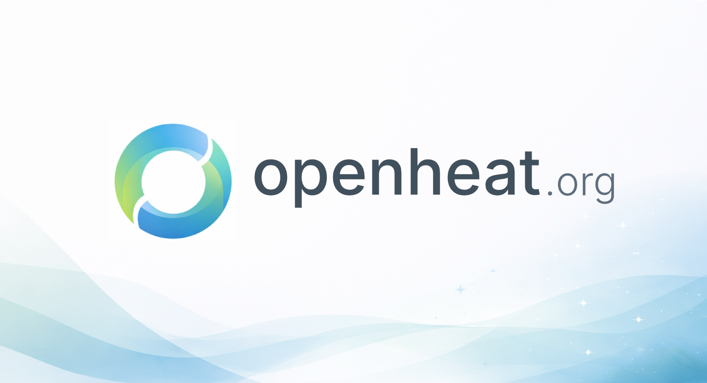

# Open Heat Initiative

The **Open Heat Initiative** is a community owned, open source effort to support a healthier, more respectful, and more collaborative global spicy community.

It provides shared, values driven standards that communities can use, adapt, and build upon without central ownership or control.

This repository hosts the **Open Heat Community Code**, the first resource released as part of the Initiative.

---

## What Is the Open Heat Community Code?

The **Open Heat Community Code** is a short, values based framework that describes the kind of culture we want to foster across spicy communities worldwide.

It is designed to help communities:
- Create safer, more inclusive spaces
- Encourage respectful disagreement and discussion
- Support creators, competitors, and organizers
- Collaborate across platforms, regions, and cultures
- Establish shared expectations without rigid enforcement

The Community Code is not a rulebook.  
It is a foundation for culture.

---

## Who This Is For

The Open Heat Initiative is intended for anyone involved in the spicy world, including:
- Community organizers
- Competition hosts and leagues
- Creators and content platforms
- Competitors and participants
- Online forums, Discord servers, and social groups

Any group can adopt the Community Code as is, or use it as a starting point for their own community standards.

---

## Why Open Source?

The spicy community is global and rapidly growing. No single organization should define how communities interact.

By being open source and licensed under Creative Commons, the Open Heat Community Code:
- Is free to use and share
- Can be adapted, translated, or extended
- Can evolve through community input
- Remains neutral and community owned

Open standards create stronger, more resilient communities.

---

## How to Use This Code

You are encouraged to:
- Adopt the Community Code in your community
- Reference it in your rules or onboarding materials
- Adapt it to fit your local context
- Translate it into other languages
- Build additional resources on top of it

Use of the Community Code requires attribution in accordance with the Creative Commons license.

---

## Contributing

The Open Heat Initiative grows through community participation.

Contributions may include:
- Suggested improvements or clarifications
- Language translations
- New supporting resources
- Feedback from real world use

Please see `CONTRIBUTING.md` for guidelines on how to participate.

---

## Sponsors

The Open Heat Initiative is supported by sponsors who believe in open, community driven standards.

**Firehub** is the first Sponsor of the Open Heat Initiative.

Sponsorship provides resources and support for the Initiative’s growth, but does not grant ownership, control, or special authority over the standard.

---

## License

This project is licensed under the Creative Commons Attribution 4.0 International License (CC BY 4.0).  
https://creativecommons.org/licenses/by/4.0/

Attribution is required when using or adapting this work.

---

## About the Initiative

The Open Heat Initiative is independent and community driven. While platforms and organizations may adopt, support, or sponsor it, no single entity owns or controls the standard.

The goal is simple:  
A more respectful, inclusive, and unified spicy community built together.
